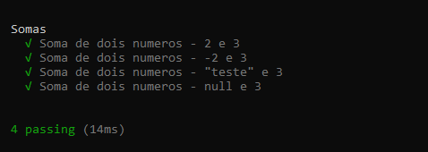

# Aplicação de TDD (Test Driven Development) - Teste de soma de dois valores
 
Imagem com resultado dos testes aplicados:  

  
 Projeto desenvolvido seguindo tutotial da série de vídeos do canal do Mateus Fernandes:
 
 https://www.youtube.com/watch?v=J0qWfELO41U
